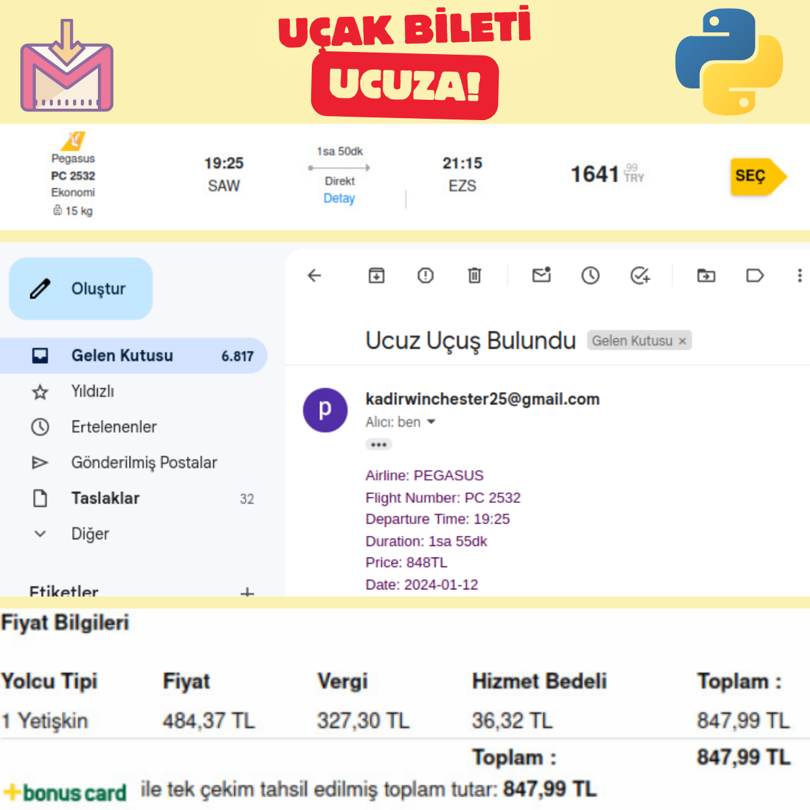

# Ucuza Uçuş Bileti  [TR]

Bu  Python uygulaması, sizin istediğiniz eşik fiyatın altına düşen uçuşları size mail olarak gönderir.
Verileri https://www.ucuzabilet.com/ sitesinden çekmektedir ve belirli aralıklarda bu işlemi tekrar ettirebilirsiniz.



## Kullanım

1. **Kütüphanelerin Yüklenmesi:**
   - Projeyi çalıştırmadan önce gerekli kütüphaneleri yükleyin.
     ```bash
     pip install -r requirements.txt
     ```

2. **E-posta Ayarları:**
   - `send_mail` fonksiyonunda e-posta gönderme işlemi yapılmaktadır. Bu kısmı kendi e-posta bilgilerinizle güncelleyin.
   - **Burada dikkat edilmesi gereken nokta gönderici Google hesabınıza gidip 2 adımlı doğrulamayı aktif edip arama yerine uygulama anahtarı yazıp şifre almanız gerekir. 16 haneli bu şifreyi burada kullanabilrisiniz. Mail hesabınızın şifresini yazmanız hata verecektir.**
   - Güvenlik nedeniyle e-posta ve şifrenizi doğrudan kod içinde tutmaktan kaçının. Gerekirse çevresel değişkenler veya başka bir güvenli yöntem kullanın.

3. **Uçuş Bilgisi Alma:**
   - `ucuzabilet_fiyatlari_al` fonksiyonunda hangi tarihler arasındaki uçuşları almak istediğinizi belirtin.
   - `nereden`, `nereye`, `b_tarih`, `bit_tarih`, `istenilen_max_fiyat` gibi değişkenleri girmeniz gerekir.
    
    

## Projenin Çalıştırılması 

1. Konsol ekranında programı çalıştırın.
   ```bash
   python run.py
 2. Kodunuzu ücretsiz bir python editörde 7/24 ücretsiz çalıştırın.  Bunun için > https://www.pythonanywhere.com/ ziyaret edebilirsiniz.

## Bize Ulaşın

[](https://www.instagram.com/kadirbulbulcom/)
[](https://www.linkedin.com/in/abdulkadirbulbul/)


# Cheap Fly Tickets [EN]

This Python application e-mails you flights that fall below your desired threshold price.
It pulls the data from https://www.ucuzabilet.com/ and you can repeat this process at certain intervals.


## Use

1. **Installing Libraries:**
    - Install the necessary libraries before running the project.
      ```bash
      pip install -r requirements.txt
      ```

2. **Email Settings:**
    - Sending e-mail is done in the `send_mail` function. Update this section with your own email information.
    - **The point to note here is that you must go to your sender's Google account, activate 2-step verification, type the application key in the search field and get the password. You can use this 16-digit password here. Typing your email account password will give an error.**
    - For security reasons, avoid keeping your email and password directly in the code. Use environmental variables or another safe method if necessary.

3. **Getting Flight Information:**
    - In the `cheapabilet_fiyatlari_al` function, specify the flights between which dates you want to buy.
    - You need to enter variables such as `from`, `where to`, `b_date`, `bit_date`, `desired_max_price`.
    
    

## Running the Project

1. Run the program on the console screen.
    ```bash
    python run.py
  2. Run your code in a free python editor 24/7 for free. For this, you can visit > https://www.pythonanywhere.com/.

## Contact Us

[](https://www.instagram.com/kadirbulbulcom/)
[](https://www.linkedin.com/in/abdulkadirbulbul/)
